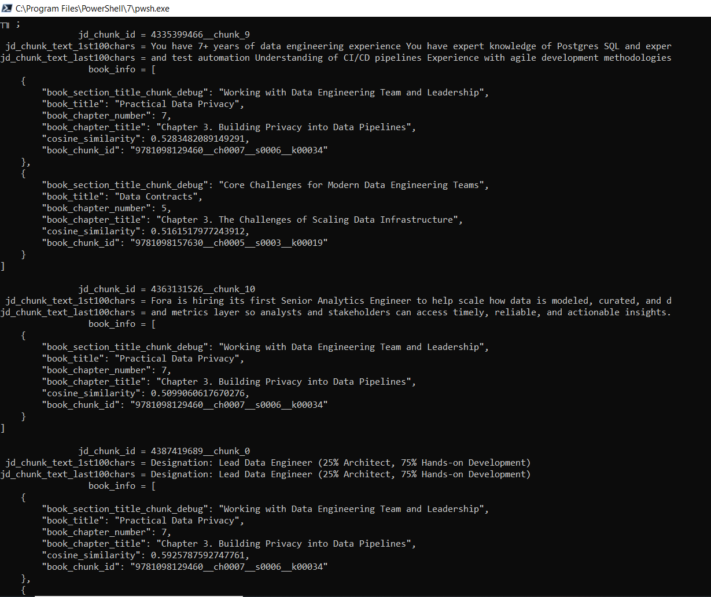

# job_reqs_book_matcher

Pipeline for **staging job postings** (JSON) and **EPUB books** into a shared **DuckDB** database with **sentence-transformer** embeddings, plus **SQL** examples under `script/sql/`.

## Layout

| Path | Purpose |
|------|---------|
| `data/` | Staging JSON inputs and `jds_books.duckdb` (default DB). Keep large/local DBs gitignored. |
| `books/` | Add `.epub` files here for batch ingest; see `books/README.txt`. |
| `script/` | Main Python tools (`embed_staging_jd_duckdb.py`, `embed_staging_books.py`, helpers). |
| `script/sql/` | DuckDB SQL (e.g. `transformations.sql` — run with repo root as `cwd` or fix `ATTACH` paths). |
| `archive/chromadb/` | Legacy Chroma-based ingest; optional and usually **not** in git. |

## Setup

1. **Python 3.10+** recommended.  
2. Create and activate a venv (e.g. `script/setup_venv.ps1` on Windows).  
3. Install runtime deps: `duckdb`, `sentence-transformers`, `numpy`, and a PyTorch build suitable for your machine (and any other imports your stack uses). Add a `requirements.txt` if you want pinned versions.

**Optional environment variables**

- `JD_STAGING_DATA_DIR` — directory for `jds_books.duckdb` and related data.  
- `JD_BOOKS_DIR` — book input directory (default: `books/`).

## Job postings → DuckDB

From `script/` with the venv active:

```bash
python embed_staging_jd_duckdb.py --reset --min-merge-chars 10
```

Default input: ../data/linkedin_data_engineer_edison_50mi.json (override with --input).
Table: staging_jd in data/jds_books.duckdb (paths configurable; see local_paths / duckdb_connect).


## Books (EPUB) → DuckDB

```bash
python embed_staging_books.py
python embed_staging_books.py --headers-only
python embed_staging_books.py --epub "../books/Your Book.epub"
```

Table: staging_books in the same DuckDB file. See the script’s docstring for --reset, resume, and limits.

## SQL

script/sql/transformations.sql — example joins / similarity ideas. Use DuckDB with cwd at the repo root so data/jds_books.duckdb matches the ATTACH in the file, or edit paths.

## Sample Report

